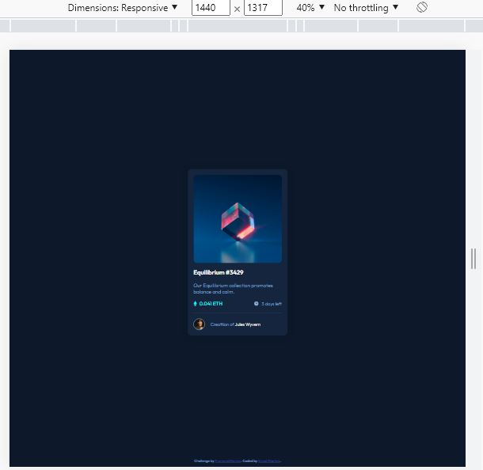
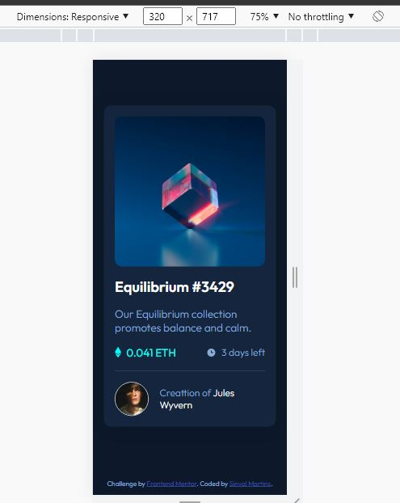

# Frontend Mentor - NFT preview card component solution

This is a solution to the [NFT preview card component challenge on Frontend Mentor](https://www.frontendmentor.io/challenges/nft-preview-card-component-SbdUL_w0U). Frontend Mentor challenges help you improve your coding skills by building realistic projects.

## Table of contents

- [Frontend Mentor - NFT preview card component solution](#frontend-mentor---nft-preview-card-component-solution)
  - [Table of contents](#table-of-contents)
  - [Overview](#overview)
    - [The challenge](#the-challenge)
    - [Screenshot](#screenshot)
      - [Desktop](#desktop)
      - [Mobile](#mobile)
    - [Links](#links)
  - [My process](#my-process)
    - [Built with](#built-with)
    - [What I learned](#what-i-learned)
    - [Useful resources](#useful-resources)
  - [Author](#author)

## Overview

### The challenge

Users should be able to:

- View the optimal layout depending on their device's screen size
- See hover states for interactive elements

### Screenshot

#### Desktop



#### Mobile



### Links

- Solution URL: [GitHub](https://github.com/smartinsdev/ntf-card-component)
- Live Site URL: [Deploy](https://smartinsdev.github.io/ntf-card-component)

## My process

This project had some small challenges such as creating an interactive state when hovering the mouse over the image, title and user name.

### Built with

- Semantic HTML5 markup
- CSS custom properties
- Flexbox
- CSS Grid
- Mobile-first workflow

### What I learned

In this project my biggest learning was in developing a background color along with an icon over the image.

See below:

```html
<a href="#" class="wrap-thumbnail">
  
  <div id="thumbnail-hover">
    
  </div>
</a>
```

```css
.content .wrap-thumbnail {
  position: relative;
}

.content .wrap-thumbnail #thumbnail {
  border-radius: 12px;
  width: 100%;
  height: 100%;
}

.content .wrap-thumbnail #thumbnail-hover {
  transition: .5s ease;
  opacity: 0;
  position: absolute;
  top: 50%;
  left: 50%;
  width: 100%;
  height: 100%;
  transform: translate(-50%, -50%);
  -ms-transform: translate(-50%, -50%);
  display: grid;
  place-items: center;
  background-color: hsl(178, 100%, 50%, 30%);
  border-radius: 12px;
}

.content .wrap-thumbnail #thumbnail-hover:hover{
  opacity: 1;
}
```
### Useful resources

- [Example resource 1](https://www.w3schools.com/howto/howto_css_image_overlay.asp) - This helped me for how to create image overlay hover effects. I really liked this pattern and will use it going forward.

## Author

- Website - [Sinval Martins](https://github.com/smartinsdev)
- Frontend Mentor - [@smartinsdev](https://www.frontendmentor.io/profile/smartinsdev)
- Twitter - [@smartinsdev](https://twitter.com/smartinsdev)
